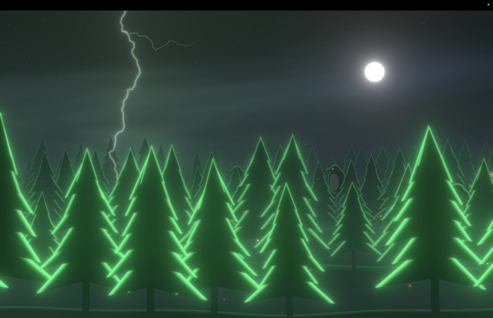
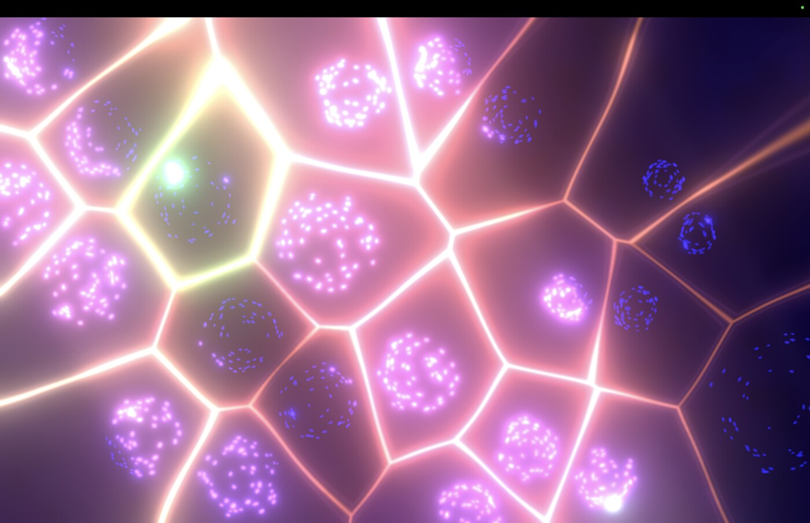
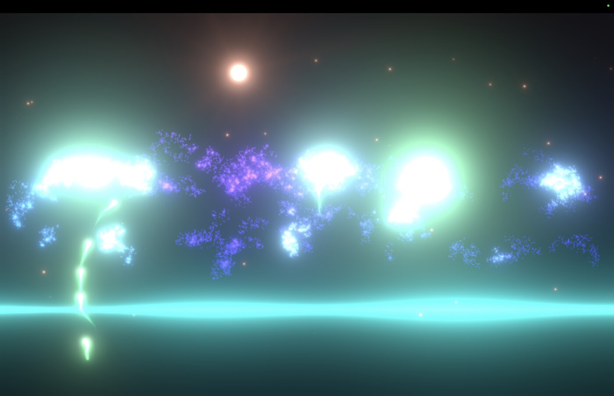
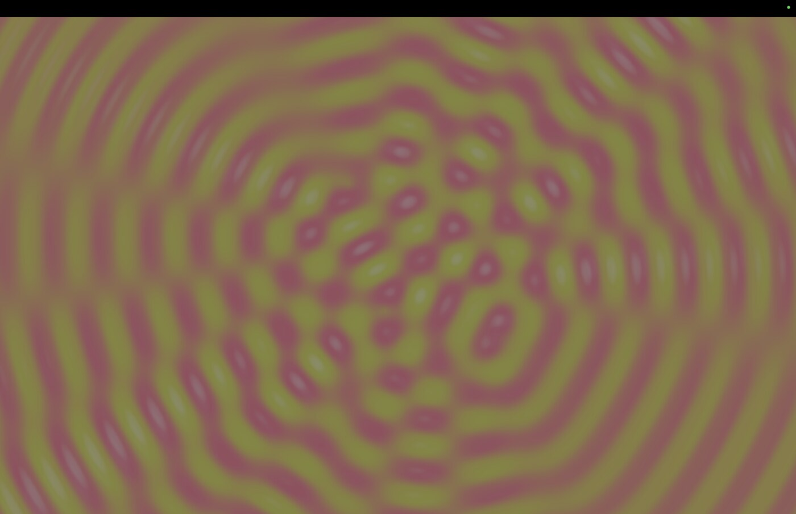

# ⚡️ revoltage ⚡️
## What Is This
Revoltage is a platform I built for audiovisual experiments at [Re:Voltage](https://www.departurearts.org/events/httpsmariafinkelmeier.comrevoltage-reg), an experimental one-day performance & hackathon Sept 10 2026 in Boston.

Users of Revoltage can define multiple Typescript "apps" which use various inputs and outputs to do whatever they want. Inputs and outputs include audio, MIDI, visuals (webcam and projector), and serial data as control signals (e.g. sensors via Arduino).
All the apps run in a common platform harness, which provides shared functionality: a control panel UI, a "setlist" of apps and a concept of parameters controllable via UI or MIDI (I used an [APC mini](https://www.akaipro.com/apc-mini-mk2)).
Design and decisions: [docs/SPEC.md](docs/SPEC.md). Sensor wiring: [docs/ARDUINO.md](docs/ARDUINO.md).
macOS + Chrome only.

I used Revoltage to send MIDI to my [OP1](https://teenage.engineering/products/op-1), and then used the audio signal from the OP1 as one of the control inputs for the visual apps I defined.

<table>
  <tr>
    <td width="50%"></td>
    <td width="50%"></td>
  </tr>
  <tr>
    <td width="50%"></td>
    <td width="50%"></td>
  </tr>
</table>

<p align="center"><em>Here's a few realtime reactive audio-visual apps I built</em></p>

## Run

```sh
npm install
npm run models   # once: copies the MediaPipe runtime and downloads vision models into public/
npm run dev      # http://localhost:5173 with hot reload
npm run show     # production build on the same port, for the performance
npm run chrome   # (re)opens Chrome on it with background throttling off
```

1. Open http://localhost:5173 in Chrome and click **Start** (allow microphone, MIDI and camera).
2. Press **O** to open the output window, drag it to the projector, then click inside it (or press **F**) for fullscreen.

**Screen sharing (Google Meet, NDI):** open Chrome with `npm run chrome`. Otherwise Chrome stops
drawing the output window whenever it's covered, in another Space or behind the sharing app, and the
share freezes. The script asks before quitting a running Chrome (a Meet call in Chrome will drop).

## Control Keys (control window)

I originally used an [Akai APC mini](https://www.akaipro.com/apc-mini-mk2) for the performance, but any MIDI controller with buttons and faders will work. The app UI is also controllable via mouse or touch.

| Key | Action |
|---|---|
| 1–8 | Load setlist slot |
| ← / → | Previous / next setlist slot (also the APC ◀ ▶ buttons) |
| B | Blackout |
| Shift+P | Panic (mute app audio, all notes off) |
| Space / T | Clock play-stop / tap tempo |
| O | Open or focus the output window |

## Writing an app

Create `src/apps/<name>/index.ts` with a default export from `defineApp` (see
`src/apps/test-pattern` and `src/apps/pulse`). The app API lives in `src/sdk/`.
Apps hot-reload while you edit them; devices stay open.
