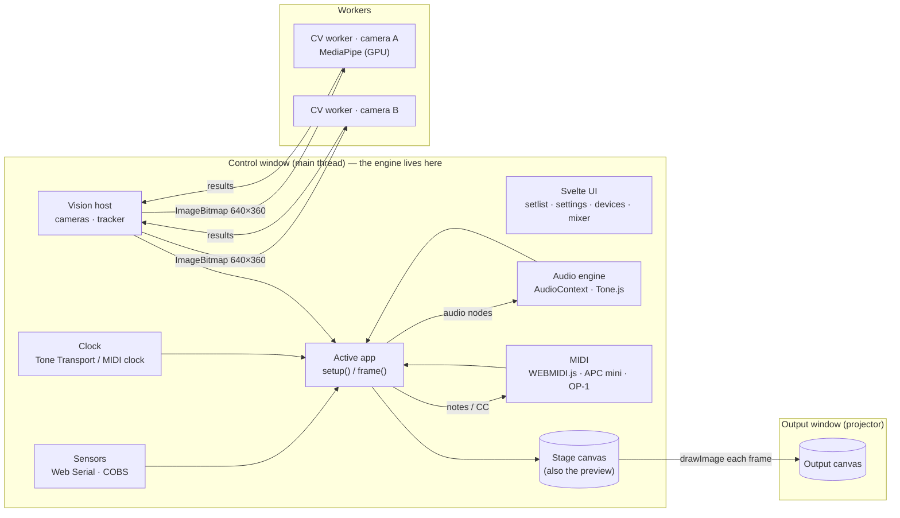

# Revoltage — Platform Tech Spec

**Status:** v0.1 draft · 2026-09-10
**Target:** live performance tonight (2026-09-10), then ongoing development
**Browser:** Google Chrome (desktop, macOS, Apple Silicon) only

---

## 1. Summary

Revoltage is a browser-only platform for writing small audiovisual **apps**. Apps react to live inputs and send output to three places:

- **Inputs:** audio, MIDI, cameras with computer vision (CV), and Arduino sensors.
- **Outputs:** visuals to a projector, sound to the PA, and MIDI to hardware.

The **platform** owns every device, the audio graph, the render loop and all timing.

An **app** is one TypeScript module. It declares a name, a description and a parameter schema, and implements `setup()` and `frame()` against a stable SDK (§7). Everything runs locally in the page, with no servers and no network, so it works offline at a venue.

### Goals

- **Minimal setup:** one control window and one output window, both in Chrome, served from `localhost`.
- **Fast to write apps:** a reactive visual takes about 50 lines. Apps hot-reload during development.
- **Realtime:**
  - visuals at 60 fps at projector resolution
  - low-latency audio and MIDI
  - CV at roughly 30 fps per camera
- **Show-safe:** a device dropping out, an app crashing or a window closing never takes down the show.
- **Use well-known open-source libraries** instead of writing our own device handling, DSP or CV.

### Non-goals (for now)

- Dia, Safari, Firefox and mobile.
- Crossfading or layering apps. The design has hard cuts only but leaves room for crossfades (§7.2).
- A generic MIDI-learn system. Apps map controls in code.
- Live-coding during the show, or recording the show output.
- Servers, network sync and OSC.

---

## 2. Decisions from the design interview

| Topic | Decision |
|---|---|
| Browser | Chrome only |
| Displays | Two windows. The control window sits on the laptop; the output window runs fullscreen on the projector (extended display). |
| App switching | Hard cut, one app at a time. A setlist holds up to 8 slots. |
| Controller mapping | Apps read MIDI in code. The platform provides typed helpers for the APC mini (**mk1**, confirmed from its USB ID) and the OP-1, and reserves a few global controls (§9). |
| Audio routing | **All sound goes through the browser mix to the laptop output and then the PA.** The per-input mixer is the real mix. |
| Laptop mic | Not used. It stays addressable, but nothing opens it by default. |
| What apps do with audio | Analysis, processing inputs, synthesis, record/loop, and sequencing |
| Clock | Internal transport by default. It can be switched to follow external MIDI clock. |
| Rendering | Each app picks a surface: `2d`, `webgl2` (raw WebGL2 or twgl), `three` or `p5` |
| Changes during the show | Parameters only. Hot module reload (HMR) is a development convenience. |
| Vision | Body pose and motion, hands and gestures, zone motion, and a person mask |
| Device binding | **No naming step.** Apps use built-in short names (`op1`, `apc`, `webcam`, `laptopcam`, `sensors`) or any part of a device's system name, plus `input` picker params (§5 rule 6). Vision models run only while an app subscribes to them. |
| Param types | toggle, number, slider, select, color, trigger, xy, vec3, input picker, zones |
| Persistence | Autosave per app, named presets, and JSON export/import |
| Sensors | Arduino Uno R3 or classic Nano over USB serial. Starts with 2× HC-SR04; the protocol is generic so more sensors can be added. |
| First app | Audio-reactive shader, called **Pulse** (§13) |

---

## 3. Hardware and environment

| Role | Device | Notes |
|---|---|---|
| Computer | MacBook Pro (Apple Silicon), Chrome 152, Node 23 | Built-in display runs at 120 Hz. Projector resolution and refresh are unknown until the venue. |
| Audio in | OP-1 over USB | Reports to macOS as `OP-1` (Teenage Engineering, product ID 0x0004), with 2 inputs and 2 outputs at **44.1 kHz** |
| Audio in | Built-in microphone | **Not used** |
| Audio out | MacBook headphone out (or any USB device) to the PA | Selectable with `setSinkId` |
| MIDI | OP-1 (USB MIDI) | Notes and CC in, notes and clock out |
| MIDI | Akai APC mini **mk1** (USB MIDI) | Reports as `APC MINI` (product ID 0x0028). 8×8 pads that light green, red or yellow; 8 track buttons (red LEDs); 8 scene buttons (green LEDs); Shift; 9 faders |
| Video | Logitech USB webcam, built-in FaceTime camera | Request 1280×720 at 30 fps; CV runs on downscaled frames |
| Sensors | Arduino Uno R3 or classic Nano with 2× HC-SR04 | The USB-serial bridge chip (16U2 or CH340) runs at 250 000 baud |

---

## 4. Stack

Versions were checked against npm on 2026-09-10. Pin exact versions in `package.json`.

| Concern | Choice | Version | Why |
|---|---|---|---|
| Build and dev server | **Vite** | 8.3.x | Fast HMR, `import.meta.glob` for discovering apps, bundling for workers and worklets |
| Language | **TypeScript** (strict) | 6.x | Not 7.0: the Go-based compiler has no stable API yet, so svelte-check and friends can't use it |
| Control UI | **Svelte** | 5.x | Compiles to direct DOM updates with no virtual DOM, keeping the render loop unaffected. Small output. |
| Settings widgets | **Tweakpane** + `@tweakpane/plugin-essentials` | 4.0.5 / 0.2.1 | Slider, checkbox, list, color, button, point2d and point3d built in. Driven by our schema. |
| Synthesis, effects, scheduling | **Tone.js** | 15.1.x | Synths, effects, players and granular playback, plus the Transport |
| Audio features | Web Audio `AnalyserNode`, plus **Meyda** (optional) | built in / 5.6.3 | FFT and RMS are native. Meyda adds centroid, flatness, MFCC and chroma. Meyda is stable but no longer actively developed. |
| Pitch detection | **pitchy** | 4.1.0 | Small, written in TypeScript |
| MIDI | **WEBMIDI.js** | 3.1.16 | Standard Web MIDI wrapper with TypeScript types and timestamped sends |
| Vision | **@mediapipe/tasks-vision** | 1.0.1 | Pose, gestures with hand landmarks, and segmentation. GPU delegate works in workers. Model files can be bundled. |
| 3D and shaders | **three.js** | r186 | `WebGLRenderer` (GLSL) by default |
| Sketching | **p5.js** (instance mode) | 2.3.x | Fastest way to sketch. Version 2.x is now the default. |
| Shader helpers | **twgl.js**, **vite-plugin-glsl**, **lygia** | 7.0 / 1.6 / 1.4 | Fullscreen-quad programs, `#include`, noise and color functions |
| Smoothing | **1eurofilter** | 1.3.0 | Removes jitter from sensor and CV data |
| Arduino | **NewPing**, **PacketSerial** (COBS) | Arduino Library Manager | Standard HC-SR04 driver and packet framing |
| Tests | **Vitest** | latest | Pure modules only: COBS, CRC, param coercion, BPM estimator |

**Deferred or optional:**

- **hydra-ts:** Hydra video synth as an app type.
- **@techstark/opencv-js:** optical flow and background subtraction.
- **onnxruntime-web:** multi-person pose with RTMO or YOLO-pose if MediaPipe struggles with crowds. YOLO weights are AGPL.
- **@grame/faustwasm:** custom DSP.
- **pmndrs/postprocessing:** three.js post-processing effects.

**Rejected:**

- **essentia.js:** stale; license needs checking.
- **aubiojs:** unmaintained.
- **dat.gui:** deprecated.
- **Leva:** React-only.
- **Theatre.js:** public development has stalled.
- **tfjs pose models:** no release in about 2 years.
- **SharedArrayBuffer with COOP/COEP headers:** not needed in v1.

**Install policy:** every library is declared in `package.json` (or vendored under `firmware/libraries/` for Arduino) and lives inside the repo. Nothing system-level is installed without asking first. Flashing uses the `arduino-cli` bundled inside the Arduino IDE, which is already on the machine.

---

## 5. Architecture



### Architectural rules

1. **The engine lives in the control window.** That includes devices, the audio graph and the app instance. The output window only displays: it can close or reload at any time without affecting anything.
   - Same-origin popups share the opener's main thread in Chrome, so a separate window buys no thread isolation anyway.
2. **Render once, then mirror.**
   - The app renders into a **stage canvas** in the control window. The stage is sized to the output resolution and shown scaled down as the live preview.
   - After each `frame()`, the engine copies the stage into the output window's 2D canvas with `drawImage`, a GPU-to-GPU copy within one process.
   - ⚠ Spike **S1** checks the cost. Fallback: the surface's canvas lives in the output document and the preview becomes a low-fps copy.
3. **The output window's `requestAnimationFrame` drives the loop** while that window is open. That locks rendering to the projector's refresh, and the loop isn't throttled when the control window is covered. Without an output window, the control window's rAF drives it.
   - Refresh rates differ (120 Hz vs 60 Hz), so all motion uses `dt`.
4. **Heavy work stays off the main thread.**
   - MediaPipe inference runs in one module worker per camera.
   - DSP runs on the audio thread (native nodes and AudioWorklets).
   - The main thread only takes input snapshots, runs the app's `frame()`, and draws the UI.
5. **Inputs are available as both pull and push.**
   - Pull: during `frame()`, apps read the latest state of any input.
   - Push: apps can subscribe to events (MIDI, sensor samples, clock ticks, param triggers) for the lowest latency.
   - Push callbacks may make sound or send MIDI, but must never render.
6. **Device names are stable endpoints, with no naming step.**
   - Apps refer to a device by a **built-in short name** or by **any case-insensitive part of its system name**:

     | Short name | Matches (system name) |
     |---|---|
     | `op1` | `/OP-1/` (audio and MIDI) |
     | `apc` | `/APC MINI/i` |
     | `webcam` | `/Logitech\|BRIO\|C9\d\d\|Webcam/i` |
     | `laptopcam` | `/FaceTime\|MacBook.*Camera/i` |
     | `laptopmic` | `/MacBook.*Microphone/i` |
     | `sensors` | The Arduino serial port. Its channels are named by the board (`distL`, `distR`). |

     Anything else works by substring, e.g. `ctx.audio.input('zoom')`. The API below calls whatever name an app used its `alias`.
   - Virtual and meeting devices (`ZoomAudioDevice`, `Microsoft Teams Audio`, iPhone Continuity mics) are hidden from pickers.
   - Devices come and go behind a name. Handles stay valid, and read as silent, zero or `present: false` while offline.
7. **Apps import only from `src/sdk`.** The SDK holds types plus `defineApp` and `defineParams`; the engine implements it. That boundary is the platform API.

### Frame loop

```
tick(now):                       // output-window rAF (or control rAF)
  dt = clamp((now - last)/1000, 0, 1/15)
  midi.drain()                   // queued events → f.midi (push callbacks already fired)
  sensors.drain()                // samples since last frame → filters → channel state
  audio.analyse()                // AnalyserNode reads: each input + master → features
  vision.poll()                  // latest worker results (arrived async) → tracker
  clock.snapshot()               // bpm, beats, phase
  apc.flushLeds()                // at most 30 Hz, diff only
  guarded(app.frame(f))          // try/catch; errors counted and logged
  output.mirror()                // drawImage(stage → output canvas), or black if blackout
  ui.stats(now)                  // meters and graphs ≤ 30 Hz, drawn on canvases, never via Svelte state
```

---

## 6. Repository layout

```
index.html                  control window
output.html                 output window (canvas + fullscreen handling only)
vite.config.ts              fixed port 5173 for dev AND preview (permissions are per origin)
src/
  main.ts                   boots the engine, mounts the Svelte UI
  output.ts                 output window script
  sdk/                      THE PLATFORM API: types, defineApp, defineParams, helpers
    index.ts  params.ts  types.ts  smoothing.ts  color.ts
  engine/
    engine.ts               singleton; boot/start; kept across HMR via import.meta.hot.data
    loop.ts  apphost.ts  setlist.ts  globals.ts (reserved controls, keyboard)
    output-window.ts        open/position/fullscreen/mirror
    persistence.ts          localStorage + JSON export/import
    surfaces/               canvas2d.ts webgl2.ts three.ts p5.ts
    devices/registry.ts     short name / substring → physical device (matched by label)
    audio/                  engine.ts strip.ts features.ts onset.ts recorder.ts recorder.worklet.ts
    midi/                   midi.ts apc-mini.ts op1.ts clock-in.ts clock-out.ts
    clock/clock.ts
    vision/                 cameras.ts vision.ts cv.worker.ts zones.ts tracker.ts
    sensors/                serial.ts cobs.ts crc8.ts protocol.ts channel.ts
    params/                 store.ts pane.ts presets.ts coerce.ts
  ui/                       Svelte components (Setlist, Stage, Settings, ZoneEditor, Devices, Mixer, Stats, Log)
  apps/
    pulse/  index.ts  pulse.frag  feedback.frag
public/
  mediapipe/wasm/           copied from node_modules/@mediapipe/tasks-vision/wasm
  models/                   *.task / *.tflite (committed so the repo works offline)
firmware/
  revoltage_sensors/revoltage_sensors.ino
scripts/
  fetch-models.sh           downloads the MediaPipe models (run once, then commit)
docs/
  SPEC.md
```

**npm scripts:**

- `dev`: Vite on 5173.
- `show`: `vite build && vite preview --port 5173 --strictPort`.
- `test`: runs Vitest.
- `models`: runs `scripts/fetch-models.sh`.

---

## 7. Platform API (the SDK)

### 7.1 Defining an app

```ts
// src/apps/example/index.ts
import { defineApp, defineParams } from '@sdk';

export default defineApp({
  id: 'example',                        // stable; used for persistence keys
  name: 'Example',
  description: 'Circles that breathe with the OP-1 and jump with the APC faders.',
  surface: '2d',
  params: defineParams({
    source: { type: 'input', kind: 'audioIn', default: 'op1', description: 'Audio that drives the size' },
    count:  { type: 'slider', min: 1, max: 64, step: 1, default: 12, description: 'Number of circles' },
    color:  { type: 'color', default: '#ff3366', description: 'Fill color' },
    burst:  { type: 'trigger', description: 'One-shot burst' },
  }),
  setup(ctx) {
    const { g2d } = ctx.surface;
    const audio = ctx.audio.input({ param: 'source' });        // follows the picker
    ctx.midi.apc?.on('fader', (i, v) => { if (i === 0) ctx.params.set('count', 1 + v * 63); });

    return {
      frame(f) {
        const { width: w, height: h } = ctx.surface;
        g2d.fillStyle = 'black'; g2d.fillRect(0, 0, w, h);
        const r = 20 + 300 * audio.features.bassAuto + (f.fired('burst') ? 200 : 0);
        g2d.fillStyle = ctx.params.color;
        for (let i = 0; i < ctx.params.count; i++) {
          const a = (i / ctx.params.count) * Math.PI * 2 + f.t * 0.3;
          g2d.beginPath(); g2d.arc(w / 2 + Math.cos(a) * w / 3, h / 2 + Math.sin(a) * h / 3, r, 0, 7); g2d.fill();
        }
      },
    };
  },
});
```

### 7.2 App contract and lifecycle

```ts
type SurfaceKind = '2d' | 'webgl2' | 'three' | 'p5';

interface AppDef<S extends ParamSchema, K extends SurfaceKind> {
  id: string;
  name: string;
  description: string;
  surface: K;
  params: S;
  setup(ctx: AppContext<S, K>): AppInstance | Promise<AppInstance>;
}

interface AppInstance {
  frame(f: Frame): void;
  resize?(width: number, height: number): void;  // surface was resized (device pixels)
  dispose?(): void;                               // free anything ctx.own() didn't
}

interface Frame {
  t: number;          // seconds since this app mounted
  dt: number;         // seconds since the last frame (clamped to ≤ 1/15)
  frame: number;      // frame index since mount
  now: number;        // performance.now() at tick
  clock: ClockSnapshot;
  midi: readonly MidiEvent[];      // every MIDI event since the last frame (all aliases)
  fired(trigger: string): boolean; // did this trigger param fire since the last frame?
}

interface AppContext<S, K> {
  surface: Surface<K>;
  params: ParamValues<S> & ParamControls<S>;  // read: ctx.params.speed; write: ctx.params.set('speed', 2)
  presets: { list(): string[]; save(name: string): void; recall(name: string): void };
  audio: AudioAPI;
  midi: MidiAPI;
  vision: VisionAPI;
  sensors: SensorAPI;
  clock: ClockAPI;
  own<T extends { dispose(): void } | (() => void)>(x: T): T;  // released on unmount
  log(...args: unknown[]): void;                              // goes to the control window log
}
```

**Lifecycle, handled by `apphost.ts`:**

1. **Load.** The engine discovers apps with `import.meta.glob('../apps/*/index.ts')`. All setlist modules are **preloaded when you click Start**, so switching doesn't wait on imports.
2. **Mount.**
   1. Create a fresh canvas for the surface kind.
   2. Build `ctx`.
   3. `await setup(ctx)`, with a 5-second timeout. A timeout shows as an error and leaves the output black.
   4. Start calling `frame()`.
3. **Hard cut** (from setlist, keyboard or APC):
   1. Fade the app audio bus to 0 over 80 ms.
   2. Call `dispose()`.
   3. Run every `ctx.own` disposer: listeners, Tone nodes, vision subscriptions, timers.
   4. Send all-notes-off on every MIDI output the app used.
   5. Clear the APC app LED layer.
   6. Release the GL context with `WEBGL_lose_context`, then remove the canvas.
   7. Mount the next app.

   Target: under 300 ms to the first frame. Chrome silently drops the oldest context beyond about 16 WebGL contexts, so forced disposal matters.
4. **Errors.**
   - Every call into an app is wrapped in try/catch, and errors go to the Log panel with a stack trace.
   - After 10 consecutive `frame()` errors the app is **suspended**: the output goes black and a "Restart app" button appears.
   - The engine and all devices keep running.
5. **HMR (dev only).** Each app module accepts its own updates, and the engine hot-remounts the app with its current param values. Devices are never re-requested, because engine singletons persist in `import.meta.hot.data`.
6. **Room for crossfades later.** Because each app renders into its own canvas and has its own audio bus, a future A/B crossfade only needs to mount two instances and composite them.

### 7.3 Params

**Schema.** Every entry can have `label?`, `description` (required; shown as a tooltip and help text) and `group?`.

| `type` | Extra fields | Value type | UI (Tweakpane unless noted) |
|---|---|---|---|
| `toggle` | `default: boolean` | `boolean` | checkbox |
| `number` | `default, min?, max?, step?` | `number` | number field |
| `slider` | `default, min, max, step?, curve?: 'lin' \| 'exp'` | `number` | slider |
| `select` | `options: readonly string[] \| Record<label, value>`, `default` | option union | dropdown list |
| `color` | `default: '#rrggbb'` | `string` | color picker |
| `trigger` | — | `number` (fire count) | button; `f.fired(key)` / `ctx.params.on(key, cb)` |
| `xy` | `default: {x,y}`, `min?`, `max?` | `{x:number,y:number}` | point2d pad |
| `vec3` | `default: {x,y,z}`, `min?`, `max?` | `{x,y,z}` | point3d |
| `input` | `kind: 'camera' \| 'audioIn' \| 'midiIn' \| 'midiOut' \| 'sensor'`, `default?: alias` | alias `string` | dropdown of current aliases, refreshed when devices change |
| `zones` | `camera: string` (an `input` param key or an alias), `default: Zone[]` | `Zone[]` | **custom Svelte ZoneEditor**: draw and name rectangles or polygons on a live preview of that camera |

**Semantics:**

- **Types.** `defineParams` uses a `const` generic, so `ctx.params` is fully typed. For example, `select` values become a union of the option strings.
- **Reads** are plain property reads on a live object, safe to do every frame. **Writes** go through `ctx.params.set(key, value)`, which clamps and coerces the value, updates the UI, marks it for autosave and notifies `ctx.params.on(key, cb)` listeners.
- **Apps map MIDI to params in code**, typically `apc.on('fader', …) → ctx.params.set(…)`. That way presets and the settings page always show the true state.
- **Persistence:**

  | What | localStorage key | Notes |
  |---|---|---|
  | Param values | `rv1:app:<id>:params` | Autosaved, debounced 300 ms |
  | Presets | `rv1:app:<id>:presets` | `{ [name]: values }` |

  On load, stored values are **coerced against the current schema**: unknown keys are dropped, missing keys get their defaults, and numbers are clamped. That lets the code change safely under saved data.
- **Presets.** The settings page has save, recall, rename and delete. Apps can call `ctx.presets.recall('drop')`, for example from an APC pad. Morphing between presets is a later feature.

### 7.4 Surfaces

```ts
interface SurfaceBase { canvas: HTMLCanvasElement; width: number; height: number; pixelRatio: number }
type Surface<K> =
  K extends '2d'     ? SurfaceBase & { g2d: CanvasRenderingContext2D } :
  K extends 'webgl2' ? SurfaceBase & { gl: WebGL2RenderingContext } :        // use twgl.js freely
  K extends 'three'  ? SurfaceBase & { renderer: THREE.WebGLRenderer } :     // app owns scene/camera
  K extends 'p5'     ? SurfaceBase & { p: p5 } : never;                       // instance mode
```

- **Size** = the output window's size in device pixels × a **render scale** (0.5, 0.75 or 1.0, set in the Stats panel). It defaults to 1920×1080 when no output window is open. `resize()` is called when this changes.
- **`three`:** the platform lazy-imports three.js and creates `new WebGLRenderer({ canvas, antialias: true, powerPreference: 'high-performance' })`. Apps import `three` themselves and render in `frame()`.
- **`p5`:** the platform lazy-imports p5 and creates `new p5(sketch)` with `noLoop()`. It calls `p.redraw()` from the engine loop, so p5 draws once per engine frame. The app supplies `setup` and `draw` bodies through a helper: `ctx.surface.p.draw = () => …`.
- **`webgl2`:** created with `{ antialias: false, premultipliedAlpha: false, preserveDrawingBuffer: false }`. `sdk/gl.ts` provides a helper, `fullscreenShader(gl, frag, uniforms)`, built on twgl, plus ping-pong framebuffers for feedback effects.
- **Camera images:** `ctx.vision.video(alias)` returns the `HTMLVideoElement` for texture upload: three's `VideoTexture`, p5's `image(video)`, or `gl.texImage2D`.

### 7.5 Audio

**API:**

```ts
interface AudioAPI {
  ctx: AudioContext;                          // shared; Tone.getContext() is bound to it
  out: AudioNode;                             // the app bus; connect synths/effects here
  input(src: string | { param: string }): AudioInputHandle;   // alias, or follow an input param
  master: { features: AudioFeatures };        // analysis of the final mix
  recorder(src: AudioNode | AudioInputHandle, opts?: { maxSeconds?: number }): Recorder;
}

interface AudioInputHandle {
  alias: string;
  connected: boolean;
  node: AudioNode;                            // STABLE pre-fader stereo node; survives device swaps
  features: AudioFeatures;                    // computed pre-fader, updated every frame
  setMonitor(o: { gain?: number; muted?: boolean }): void;   // this input's level in the output mix
}

interface AudioFeatures {
  rms: number; peak: number; db: number;      // linear 0..1; dBFS
  level: number;                              // rms mapped to 0..1 over [-60, 0] dB
  bands: Float32Array;                        // 8 log bands, 40 Hz–16 kHz, dB-mapped 0..1
  bass: number; mid: number; treble: number;  // 20–150 Hz, 150 Hz–2 kHz, 2–16 kHz (0..1)
  bassAuto: number; midAuto: number; trebleAuto: number; levelAuto: number; // adaptive-normalized 0..1
  centroid: number;                           // Hz
  flux: number; onset: boolean; onsetStrength: number;       // onset = fired this frame
  spectrum: Float32Array; waveform: Float32Array;            // read-only analyser buffers
  pitch(): { hz: number; clarity: number } | null;           // computed on demand (pitchy)
}

interface Recorder { start(): void; stop(): Promise<AudioBuffer>; recording: boolean; seconds: number }
```

**Graph:**

```
device stream ─► MediaStreamSource ─► aliasBus (stable GainNode) ─┬─► AnalyserNode (pre-fader → features)
                                                                  ├─► app access: input(alias).node
                                                                  └─► monitorGain ─► muteGain ─┐
app: ctx.audio.out (appBus) ─► appFade (80 ms fades on switch) ────────────────────────────────┤
                                                                                               ▼
                               masterSum ─► limiter (DynamicsCompressor) ─► masterGain ─► masterAnalyser ─► destination
```

**Engine setup:**

- **Context:** a single `new AudioContext({ latencyHint: 'interactive' })`. The sample rate isn't forced: the context runs at the output device's rate (48 kHz for the MacBook output) and Chrome resamples the 44.1 kHz OP-1 input. If spike S3 hears artifacts, run the context at 44.1 kHz instead. The context is created and resumed by the **Start** button (autoplay policy). If `onstatechange` shows the context suspended, a banner offers "click to resume".
- **Opening inputs:**
  - Call `getUserMedia({ audio: { deviceId: { exact }, channelCount: 2, echoCancellation: false, noiseSuppression: false, autoGainControl: false } })`.
  - Then verify with `track.getSettings()`. If any processing is still on, show a **red warning**: it would make the audio mono and duck or pump the levels.
- **Monitoring defaults:** `op1` at unity gain, unmuted, because the OP-1 is only heard through the laptop. Any other input an app opens starts muted, to prevent feedback. Monitor state is saved per device.
- **Output device:** chosen in the Mixer with `ctx.setSinkId(id)`. The choice is saved by device label.
- **Limiter** (DynamicsCompressor): threshold −1 dB, knee 0, ratio 20, attack 1 ms, release 100 ms. It is always on as PA protection, with a gain-reduction meter in the Mixer.
- **Tone.js:** `Tone.setContext(ctx)` at boot. Apps `import * as Tone from 'tone'` and connect to `ctx.audio.out`. Wrap Tone nodes in `ctx.own(...)` so they are disposed on unmount.
  - Even if an app forgets, the app bus is disconnected on unmount, so leftovers are silent. They still use CPU, though.
- **Features:**
  - **Analysers:** `AnalyserNode` with fftSize 2048 and smoothing 0. Every input and the master are read once per frame, which costs about 0.1 ms each.
  - **Adaptive (`*Auto`) values:** divided by a slowly decaying running max (about 3 s), then clamped. These make visuals look good at any gain.
  - **Onsets:** spectral flux over positive magnitude differences, with an adaptive threshold (mean + k·σ over the last 0.5 s) and an 80 ms refractory period. k is set per input strip (default 1.5).
  - **Pitch:** computed only when `pitch()` is called that frame.
- **Recorder:** an AudioWorklet (`recorder.worklet.ts`, loaded via `?worker&url`) posts Float32 chunks to the main thread, which assembles them into an `AudioBuffer` for playback with `Tone.Player` or `Tone.GrainPlayer`. Its size is capped by `maxSeconds` (default 30).
- **Latency:** the Stats panel shows `baseLatency + outputLatency` and a measured OP-1 through-latency. Target: under 20 ms output latency and under 40 ms OP-1 round trip. Keep everything wired.

**Chrome limits to know:**

- `getUserMedia` delivers **at most 2 channels per device** (crbug 40403559). A macOS Aggregate Device doesn't get around this.
- The OP-1 input and the laptop output run on separate clocks. Chrome absorbs the drift, but expect a rare glitch over a long set; spike S3 listens for it.

### 7.6 MIDI and controllers

**API:**

```ts
interface MidiAPI {
  input(alias: string | { param: string }): MidiInHandle;
  output(alias: string | { param: string }): MidiOutHandle;
  apc: ApcMini | null;                         // present when an APC mini is connected
  op1: { in: MidiInHandle; out: MidiOutHandle } | null;
}
interface MidiInHandle {
  connected: boolean;
  on(type: 'noteon' | 'noteoff' | 'cc' | 'pitchbend' | 'clock' | 'message',
     cb: (e: MidiEvent) => void): () => void;  // auto-unsubscribed on unmount
  cc(ch: number, n: number): number;           // latest CC value 0..1
  held(ch?: number): ReadonlySet<number>;      // held notes
}
interface MidiOutHandle {
  connected: boolean;
  noteOn(note: number, velocity?: number, ch?: number, atMs?: number): void;   // velocity 0..1
  noteOff(note: number, ch?: number, atMs?: number): void;
  cc(n: number, value: number, ch?: number, atMs?: number): void;             // value 0..1
  send(bytes: number[] | Uint8Array, atMs?: number): void;                     // atMs = performance.now() time
  allNotesOff(): void;
}
interface MidiEvent {
  device: string;                              // alias
  type: 'noteon' | 'noteoff' | 'cc' | 'pitchbend' | 'aftertouch' | 'program' | 'clock' | 'sysex';
  ch: number;                                  // 1–16
  note?: number; velocity?: number;            // velocity 0..1
  cc?: number; value?: number;                 // value 0..1
  t: number;                                   // performance.now() timebase
  raw: Uint8Array;
}
```

**Implementation:**

- **Enabling:** `WebMidi.enable({ sysex: true })` runs from Start. Chrome shows one prompt covering MIDI and SysEx.
- **Wrapping:** WEBMIDI.js events are converted to `MidiEvent`, so apps never depend on WEBMIDI.js types.
- **Names:** short names and substrings as in §5 rule 6. There is no renaming UI.
- **Reconnects:** the `statechange` / `connected` / `disconnected` events re-bind aliases, and listeners survive reconnects.
- **MIDI monitor panel:** a live log of incoming messages. Use it to capture the OP-1 encoder CCs, which aren't documented.

**APC mini driver** (`midi/apc-mini.ts`, built for the **mk1**). Akai publishes no protocol document for the mk1, so these values are community-documented; spike S4 verifies them.

| Control | MIDI (channel 1) | Driver API |
|---|---|---|
| 8×8 pads | Notes 0–63; `n = y*8 + x`, where (0,0) is **bottom-left** | `on('pad', (x, y, down) => …)`, `held(x, y)` |
| Track buttons 1–8 (bottom row, red LEDs) | Notes 64–71 | `on('track', (i, down) => …)`, `setTrack(i, 'off' \| 'on' \| 'blink')` |
| Scene buttons 1–8 (right column, green LEDs) | Notes 82–89 | `on('scene', (i, down) => …)`, `setScene(i, …)` |
| Shift | Note 98 (no LED) | `shift: boolean` |
| Faders 1–8 | CC 48–55 | `faders: Float32Array(8)` 0..1, `on('fader', (i, v) => …)` |
| Master fader | CC 56 | **Reserved** for master volume (§9) |

**Pad LEDs:**

```ts
type ApcColor = 'green' | 'red' | 'yellow';
apc.setPad(x, y, color: ApcColor | null, blink?: boolean): void;
apc.fill((x, y) => ApcColor | null): void;
apc.clear(): void;
```

- A Note-On to a pad's note sets its LED, and the velocity picks the state:

  | Velocity | 0 | 1 | 2 | 3 | 4 | 5 | 6 |
  |---|---|---|---|---|---|---|---|
  | Pad LED | off | green | green blink | red | red blink | yellow | yellow blink |

  Track and scene LEDs use 0 off, 1 on, 2 blink.
- Blink speed is fixed in hardware and doesn't follow MIDI clock. For beat-synced flashing, apps toggle LEDs on `clock.on('beat')`.
- The APC never reports its LED state, so the driver keeps an LED frame buffer with two layers: the **app layer** and the **platform overlay** (§9). `flushLeds()` sends only the LEDs that changed, at most 30 times per second.

**Fader positions:** the mk1 can't report where its faders are. `faders[]` start at the last-seen values (saved in localStorage) and update on the first move. The master fader uses pickup (§9), which doesn't need the starting position.

**Later:** if you get an mk2, an mk2 driver (RGB pads via SysEx, clock-synced pulsing, fader-position reply) can implement the same interface.

**OP-1 (original):**

- Short name `op1`; `ctx.midi.op1` exposes its in and out handles.
- Sends and receives notes on channel 1. Its four encoders send CCs only in **CTRL mode** (COM → T2); capture the CC numbers with the MIDI monitor.
- Follows incoming MIDI clock when its tempo is set to **sync**, and sends clock when set to **beat match**. Incoming CCs only reach its MIDI LFO.
- USB audio is stereo in and out (OS 243 or later).

### 7.7 Clock and transport

```ts
interface ClockSnapshot {
  source: 'internal' | 'midi'; bpm: number; playing: boolean;
  beats: number;       // continuous beats since start (float)
  bar: number; beatInBar: number; phase: number;   // phase 0..1 within the current beat
}
interface ClockAPI extends ClockSnapshot {
  on(ev: 'beat' | 'bar' | 'step16' | 'start' | 'stop', cb: (audioTime: number) => void): () => void;
  transport: ReturnType<typeof Tone.getTransport>;  // for sample-accurate audio scheduling
}
```

**Internal mode (default):**

- **Tone.Transport is the master.** BPM is set in the top bar, with tap tempo on `T`. Space toggles play/stop.
- **Clock out:**
  - Sent to the outputs ticked in the top bar (the OP-1, off by default). The APC mini mk1 ignores clock.
  - Sends `F8` at 24 pulses per quarter note, plus `FA` (start) and `FC` (stop).
  - Scheduled from `transport.scheduleRepeat` with about 100 ms lookahead, using WEBMIDI.js timestamped sends.
  - Audio time converts to `performance.now()` time via `ctx.getOutputTimestamp()` plus `outputLatency`.

**External mode (follow MIDI clock from a chosen input, e.g. `op1`):**

- **Tempo:** estimated from a linear regression over the last 48 tick timestamps.
- **Beat phase:** comes from the tick count, interpolated between ticks, so visuals stay exactly on the grid.
- **Transport:** `Tone.Transport.bpm` is slaved to the estimate. Start and stop follow `FA` / `FC` / `FB`, and the position is re-aligned on every bar if drift exceeds 10 ms.
- **Loop prevention:** clock out to the source device is disabled automatically.
- **Dropout:** if no ticks arrive for more than 500 ms, the clock counts as stopped.

**Timing accuracy:**

- Events for visuals (`beat`, `bar`) fire on the main thread and may be up to one frame late. Use `phase` to animate.
- For sound, schedule through `transport` with its audio `time` argument.

### 7.8 Vision

**API:**

```ts
interface VisionAPI {
  cameras(): string[];                                   // aliases
  video(alias: string): HTMLVideoElement | null;         // for textures
  mirrored(alias: string): boolean;                      // per-camera setting (Devices panel)
  track(src: string | { param: string }, opts: TrackOpts): VisionHandle;   // ref-counted, auto-released
}
interface TrackOpts {
  pose?: boolean | { model?: 'lite' | 'full'; maxPeople?: number };   // default lite, 3 people
  hands?: boolean | { maxHands?: number };                             // landmarks + gestures
  mask?: boolean;                                                      // person segmentation
  zones?: Zone[] | { param: string };                                  // zone motion
}
interface VisionHandle {
  connected: boolean; fps: number; latencyMs: number; updatedAt: number;
  people: Person[]; hands: Hand[]; mask: Mask | null;
  zones: Record<string, ZoneState>;
  activity: number;              // whole-frame motion 0..1 (from the zone differ)
}
interface Landmark { x: number; y: number; z: number; visibility?: number }   // normalized image coords (0..1)
interface Person { id: number; landmarks: Landmark[] /* 33, MediaPipe order */; bbox: Rect; center: {x:number,y:number}; speed: number }
interface Hand { handedness: 'Left' | 'Right'; landmarks: Landmark[] /* 21 */; speed: number;
  gesture: { name: 'None'|'Closed_Fist'|'Open_Palm'|'Pointing_Up'|'Thumb_Down'|'Thumb_Up'|'Victory'|'ILoveYou'; score: number } }
interface Zone { name: string; points: [number, number][] }   // normalized; a rectangle is 4 points
interface ZoneState { motion: number /* 0..1 */; active: boolean; since: number }
interface Mask { width: number; height: number; bitmap: ImageBitmap; data: Uint8Array }   // about 256×144, confidence 0–255
```

**Pipeline:**

1. **Cameras** (`cameras.ts`):
   - Call `getUserMedia({ video: { deviceId: { exact }, width: 1280, height: 720, frameRate: { ideal: 30 } } })` into a hidden `<video muted playsinline>`, and read back `track.getSettings()`.
   - Cameras are matched by **label** (their system name), because deviceIds change when site data is cleared.
   - Plug the two cameras into **separate USB ports**, not one hub.
2. **Frame pump:** `video.requestVideoFrameCallback`. If a camera has subscribers and its worker is idle:
   - Create `createImageBitmap(video, { resizeWidth: 640, resizeHeight: 360 })` and transfer it to the worker.
   - **Drop frames while the worker is busy**; never queue them.
3. **Worker** (`cv.worker.ts`, one module worker per camera):
   - **Setup:** `FilesetResolver.forVisionTasks('/mediapipe/wasm', true)`. Tasks are created lazily, and **warmed at Start for every connected camera**, because model init takes seconds.
     - `PoseLandmarker`: `pose_landmarker_lite.task` (full optional), VIDEO mode, `numPoses: 3`.
     - `GestureRecognizer`: `gesture_recognizer.task`, `numHands: 4`. It includes the 21 hand landmarks, so no separate HandLandmarker is needed.
     - `ImageSegmenter`: `selfie_segmenter.tflite`, with confidence masks.
     - All tasks use `delegate: 'GPU'`, falling back to `'CPU'` if GPU init fails. The fallback is reported in Devices.
   - **Per frame:** only subscribed tasks run, with timestamps that only ever increase. Landmarks are packed into `Float32Array`s and transferred.
     - **Auto-degrade:** if worker time goes over 30 ms, hands drop to every 2nd frame, then the mask to every 3rd.
   - **Zones:**
     - Draw the frame onto a 160×90 `OffscreenCanvas` and compute luminance.
     - Keep a running background (`bg += 0.05·(lum − bg)`) and count a pixel as changed when `|lum − bg| > 20`.
     - `motion` = changed pixels / zone pixels, with smoothing and hysteresis. Zone pixel lists are precomputed on `setZones`.
     - `activity` is the same measure over the whole frame.
   - **Mask:** the confidence mask is reduced to Uint8 at about 256×144 and converted to an `ImageBitmap` via `OffscreenCanvas`. Both are transferred.
4. **Main thread (`tracker.ts`):**
   - **Person IDs:** greedy nearest-centroid matching (max distance 0.2, 500 ms time-to-live) gives stable `Person.id`s.
   - **`speed`:** mean displacement per second of 12 torso and limb landmarks, normalized by body height, then 1€-filtered. Hands get the same treatment.
   - **Mirroring:** if the camera is set to mirrored, landmark x becomes 1 − x.
5. **Models are served locally** from `public/models` and `public/mediapipe/wasm`, copied by `scripts/fetch-models.sh`:
   - pose lite (5.8 MB), pose full (9.4 MB), gesture (8.4 MB), selfie segmenter.
   - Commit them. The `latest` download URLs can change.
   - `vite.config.ts` sets `optimizeDeps.exclude: ['@mediapipe/tasks-vision']`.

**Budget:** two cameras each running pose, gestures and mask is borderline. **Spike S2** benchmarks it on this MacBook. The degrade ladder is:

1. Hands on every 2nd frame.
2. Mask at 15 fps.
3. CV runs on only one camera.

### 7.9 Sensors (Arduino over Web Serial)

**API:**

```ts
interface SensorAPI {
  connected: boolean;
  channels(): string[];                                   // names from the board's HELLO, e.g. ['distL','distR']
  get(name: string | { param: string }): SensorChannel;
  on(name: string, cb: (raw: number, tMs: number) => void): () => void;   // every sample (push)
}
interface SensorChannel {
  name: string; unit: string;
  raw: number;          // latest raw value in its unit (NaN if none/invalid)
  value: number;        // calibrated, smoothed, normalized 0..1
  present: boolean;     // a valid sample arrived within the timeout (default 300 ms)
  ageMs: number;
  samples: readonly { t: number; raw: number }[];         // every sample since the last frame (for high-rate sensors)
}
```

**Wire protocol v1.** All frames are COBS-encoded and end with `0x00`; multi-byte fields are little-endian.

| Frame | Direction | Layout |
|---|---|---|
| `DATA` | board → host | `u8 type=0x01 · u8 seq · u32 t_us · u8 n · n × (u8 channel, f32 value) · u8 crc8` |
| `HELLO` | board → host | `u8 type=0x02 · u8 version=1 · ASCII "name:unit:min:max;…" · u8 crc8`, e.g. `distL:cm:2:400;distR:cm:2:400` |
| `HELLO?` | host → board | `u8 type=0x10 · u8 crc8` |

- **Checksum:** CRC-8, polynomial 0x07, init 0x00, over the frame bytes before the CRC.
- **Sequence number:** `seq` wraps at 256 and is used to count dropped frames.
- **`n` (channel, value) pairs:** carrying pairs lets channels update at different rates (the ultrasonic sensors alternate) while still allowing fast dense sensors later.
- **Throughput:** 250 000 baud gives about 25 KB/s. Tonight's traffic is roughly 60 frames/s × 14 bytes, about 1 KB/s. A future 8 channels at 200 Hz is about 10 KB/s, 40% of the link.
- **Why 250k:** it divides the 16 MHz AVR clock exactly, and 3D printers use it on both 16U2 and CH340 bridges.

**Host (`sensors/serial.ts`):**

- **Choosing the board:** the Devices panel's **Connect** button calls `navigator.serial.requestPort({ filters })`. The filters are Arduino 0x2341 and 0x2A03, CH340 0x1A86, FTDI 0x0403 and CP210x 0x10C4. If nothing matches, use an "any device" option.
- **Auto-reconnect:** at Start, `getPorts()` reopens a previously granted board. The `navigator.serial` `connect` event reopens it after a replug, and `disconnect` marks it offline.
- **Reading:**
  - Open with `port.open({ baudRate: 250000, bufferSize: 65536 })`.
  - Read with `readable.pipeThrough(cobsFramer())`, check the CRC, then dispatch.
  - On a recoverable error (framing or break), get a new reader and loop. The main thread is fine at this data rate; move reading to a worker later if needed.
- **Handshake:** the **Uno resets when the port opens** (via DTR), so its HELLO arrives about 1.5–2 s later. If no HELLO arrives within 3 s, send `HELLO?`.
- **Per-channel pipeline:**
  1. Validity check: NaN means no echo.
  2. Median of 3.
  3. 1€ filter (minCutoff and beta adjustable).
  4. Calibration: min/max (with a 5-second "learn range" button), invert, clamp.
  5. The result is `value` in 0..1.
- **Sensors UI:** a live value and a sparkline per channel, the calibration controls, frames per second and the dropped-frame count.

**Firmware (`firmware/revoltage_sensors/revoltage_sensors.ino`):**

- **Pins:** HC-SR04 A has trig on D2 and echo on D3; B has trig on D4 and echo on D5. Both use 5 V and GND. Step-by-step wiring: [ARDUINO.md](ARDUINO.md).
- **Libraries:** **NewPing**, using its non-blocking `ping_timer` pattern from the 15-sensor example, and **PacketSerial** (COBS) at 250 000 baud.
- **Ping schedule:** the two sensors ping **alternately, every 33 ms**, giving about 15 Hz per sensor. That avoids crosstalk; each HC-SR04 needs about 29 ms or more per measurement, so **200 Hz is physically impossible for ultrasonic**. Point the sensors away from each other.
- **Values:** no echo sends `NAN`. Sends HELLO at boot and whenever asked.
- **Debug mode:** `#define DEBUG_CSV 1` switches to human-readable CSV for the Arduino Serial Monitor.

### 7.10 SDK utilities

- `smooth(tauSeconds)`: exponential smoothing that behaves the same at any frame rate: `a = 1 − exp(−dt/τ)`.
- `oneEuro({ minCutoff, beta })`: wraps `1eurofilter`.
- `map`, `clamp`, `lerp`, `quantize`, `edge()` (rising and falling edge detector), `hold(ms)`.
- Color: `hex → [r, g, b]`, HSV helpers.
- `fullscreenShader`, `pingPong` (for `webgl2`).

---

## 8. Output window

- **Open Output** (button, or `O`) calls `window.open('/output.html', 'revoltage-output', 'popup,width=…,height=…,left=…,top=…')`.
  - With Window Management permission, `getScreenDetails()` places the window on the non-primary screen.
  - Otherwise, drag the window to the projector.
- **Fullscreen:**
  1. First, try fullscreen capability delegation: from a click in the control window, call `output.postMessage(msg, { targetOrigin, delegate: 'fullscreen' })`. The output window then calls `requestFullscreen()`.
  2. Fallback: **click once inside the output window**, or press `F` there.
  - The cursor is hidden in fullscreen.
- **Reporting:** the output window reports its size and devicePixelRatio to the engine on `resize`, which resizes the surface. It also forwards key presses to the engine's global shortcuts.
- **Closing:** if the output window closes, the engine falls back to the control window's rAF and the preview continues. A "Reopen output" button appears.
- **Blackout:** the engine draws black into the output while the app keeps running, so un-blacking is instant.

---

## 9. Global controls (reserved)

These always work, whatever app is loaded.

| Input | Action |
|---|---|
| APC **master fader** (CC 56) | Master volume, with **pickup**: the fader must cross the current value before it takes control, so a stray fader position can't cause a jump. Master volume starts at 100% each session and isn't saved. |
| APC **Shift + Scene 1–8** | Load setlist slot 1–8 (hard cut) |
| APC **◀ / ▶** (track buttons 3 and 4) | Previous / next setlist slot, skipping empty slots and wrapping around |
| APC **Shift + Track 1** | Blackout on/off |
| APC **Shift + Track 8** | **Panic:** fade the app audio bus to 0 and send all-notes-off to every MIDI output. Press again to restore the audio. |
| Keyboard `1`–`8` | Load setlist slot |
| Keyboard `←` / `→` | Previous / next setlist slot |
| Keyboard `B` | Blackout on/off |
| Keyboard `Shift+P` | Panic |
| Keyboard `Space` / `T` | Transport play/stop / tap tempo |
| Keyboard `O` | Open or focus the output window |

- **What the platform consumes:**
  - Scene and track presses **while Shift is held**.
  - Track buttons 3 and 4 (◀ ▶), always.
  - The master fader.

  Everything else goes to the app, including Shift's state (`apc.shift`), all pads and faders 1–8.
- **Overlay:** while Shift is held, the platform overlay lights the scene LEDs to show the setlist: loaded slots on, the active slot blinking. On release, the app's LEDs come back.

---

## 10. Control window UI

- **Top bar:**
  - **Start** (one gesture unlocks audio, devices, MIDI and serial).
  - Output: open / fullscreen / blackout.
  - Clock: BPM, source, tap, play.
  - Master meter and volume, and the limiter's gain reduction.
  - Panic.
  - Stats: fps, frame time p95, app time, CV fps per camera, audio latency.
- **Left, Setlist:** 8 slots, filled from the app library by drag or dropdown. Shows each app's name and description; click to load.
- **Center:**
  - The **stage preview**: a scaled live view of the output.
  - Below it, **Settings** for the current app:
    - its name and description
    - the param pane (Tweakpane, grouped, with a description tooltip on each param)
    - a zone editor for each `zones` param
    - the presets bar
- **Right, tabbed:**

  | Tab | Contents |
  |---|---|
  | **Devices** | Cameras: thumbnail, name, resolution/fps, mirror, CV status and fps per task. MIDI: name, activity light, clock in/out routing. Sensors: Connect, channels, calibration. Permissions status. |
  | **Mixer** | Strips for the OP-1 and any input an app opens: name, meter, monitor gain, mute, onset sensitivity, processing-flag warning. Output device, master. |
  | **MIDI monitor** | Live log of incoming messages |
  | **Log** | App errors with stack traces, and app `ctx.log` output |

- **Rendering rule:** meters, sparklines and activity lights are drawn on `<canvas>` in the engine loop, throttled to 30 Hz. They never use Svelte reactive state.

---

## 11. Performance budgets

| Metric | Target |
|---|---|
| Output frame rate | 60 fps at 1920×1080, render scale 1.0 |
| Platform main-thread overhead | ≤ 2 ms per frame (inputs, analysis, mirror, UI) |
| App `frame()` | ≤ 8 ms; the Stats panel warns when p95 > 10 ms |
| Mirror blit | ≤ 1 ms (spike S1) |
| CV | ≥ 25 fps per camera with pose and hands; capture-to-result ≤ 60 ms |
| Audio | Output latency ≤ 20 ms; OP-1 through-latency ≤ 40 ms |
| MIDI in → push callback | < 2 ms |
| Sensor sample → app | Within 1 frame of arrival (HC-SR04 adds about 30–60 ms itself) |
| App switch, preloaded | ≤ 300 ms to first frame |
| Garbage collection | No per-frame allocation in engine hot paths; reuse typed arrays |

---

## 12. Show safety and failure handling

| Failure | Behaviour |
|---|---|
| Audio, camera, MIDI or serial device unplugged | It shows offline in Devices. Handles return silence, zeros or `present: false`. It **re-binds automatically** on replug (`devicechange`, MIDI `statechange`, serial `connect`). |
| App throws | Logged. After 10 consecutive failures the app is suspended and the output goes black. Engine and devices keep running. Use "Restart app" or load another slot. |
| App `setup()` hangs | 5-second timeout, then an error and a black output |
| WebGL context lost | The app is remounted automatically, keeping its params |
| AudioContext suspended | A banner appears; one click resumes it |
| Output window closed or reloaded | Nothing stops. The preview continues. Reopen it. |
| Too loud / runaway synth | The limiter is always on. Use Panic (Shift + Track 8 or `Shift+P`) and the master fader. |
| Page reload | Params, presets, setlist, sensor calibration, last-seen fader positions and output device all come back from localStorage. Permissions persist. Serial reconnects through `getPorts()`. You need **one click on Start**. |
| **OP-1 heard only through the laptop** | If the browser dies, the OP-1 goes silent: a single point of failure. **Mitigation:** if the PA mixer has a spare channel, run the OP-1's analog out there, muted, as a backup. |

---

## 13. First app: Pulse (audio-reactive shader)

**What it does:** a fullscreen WebGL2 feedback shader driven by the OP-1 (or any other audio input).

- **Rendering:** domain-warped fbm noise (lygia) with five modes: `warp`, `kaleido`, `tunnel`, `cells` (drifting Voronoi cells with glowing edges) and `ripple` (interference of three wandering wave sources). Ping-pong framebuffers feed back the previous frame, with zoom, rotation and decay, to create trails.
- **Audio drives the visuals:**

  | Audio feature | Visual effect |
  |---|---|
  | Level | Motion speed and brightness. `velocityDrift` blends motion speed from auto-gained level (sound vs silence) to raw loudness. |
  | Bass | Zoom pulse and warp amount |
  | Mid | Rotation speed |
  | Treble | Grain and sparkle |
  | Onset | Flash, and step to the next palette color |
  | Centroid | Hue drift |
  | Clock phase | Optional beat-locked breathing |

- **Sensors (if connected):** `distL` offsets the zoom and `distR` adds warp.

**Params:**

| Param | Type |
|---|---|
| `source` | input, audioIn, default `op1` |
| `mode` | select |
| `colorA`, `colorB`, `colorC` | color |
| `intensity`, `speed`, `zoom`, `warp`, `feedback` (0–0.98), `hueDrift`, `bassSens`, `onsetSens`, `smoothing`, `velocityDrift` | slider |
| `beatSync` | toggle |
| `center` | xy |
| `flash` | trigger |

**APC mini (mk1), mapped in the app's code:**

| Control | Action |
|---|---|
| Faders 1–8 | `intensity`, `speed`, `zoom`, `warp`, `feedback`, `hueDrift`, `bassSens`, `onsetSens`, each via `ctx.params.set` |
| Pad rows 3–4 / 5–6 / 7–8 (from the top) | Pick `colorA` / `colorB` / `colorC` from a 16-color palette (15 hues and white). The selected pad lights green / red / yellow. The mk1 pads can't show the actual colors. |
| Pad row 2 | Modes on pads 1–5 (the active one is yellow); `beatSync` on pad 8 (green when on) |
| Pad row 1 (top) | Preset slots 1–8. Saved slots are yellow and the active one is green. Shift + press saves into a slot. |
| Track 1 (no Shift) | `flash` |

**Pulse proves these parts of the platform:**

- surfaces and output mirroring
- params of every primitive type
- presets
- audio features
- the APC driver and LEDs
- the clock
- sensors (optional)

---

## 14. Build plan

Milestones are ordered by dependency and risk. **The cut line for a show-ready rig is after M5.** Every milestone after that adds capability on its own.

Once M1 fixes the SDK contracts, M3, M4, M7 and M8 are independent behind their interfaces and can be built in parallel.

| # | Milestone | Done when |
|---|---|---|
| M0 | Scaffold (Vite, Svelte, TypeScript, Vitest, layout in §6, fetch models) | `npm run dev` serves the control window |
| M1 | Engine core: loop, app host, `2d` and `webgl2` surfaces, output window with mirror and fullscreen, setlist hard cut, keyboard globals, error isolation, Stats | A test app switches cleanly on both windows at 60 fps |
| M2 | Params: `defineParams` types, Tweakpane settings page (all primitives plus xy, vec3, trigger, select, color), input picker, autosave, presets, export/import | Values persist across reloads; presets recall |
| M3 | Audio: Start gesture, device registry with short names, stable per-device buses, mixer strips, features and onset, limiter, master volume, output device, Tone.js binding, app bus fades | OP-1 metered and audible through the laptop output; processing flags verified off |
| M4 | MIDI: WEBMIDI.js, short names, events API, monitor, APC mini mk1 driver (LED layers, saved fader positions), reserved controls, OP-1 | APC pads, faders and LEDs work; Shift+Scene switches apps |
| **M5** | **Pulse** | **Show-ready** |
| M6 | Clock: internal transport, tap tempo, clock out to the OP-1, external follow | The OP-1 follows the platform, or the platform follows the OP-1 |
| M7 | Sensors: firmware, serial, protocol, calibration UI; Pulse uses distances | Both HC-SR04 values drive Pulse |
| M8 | Vision: camera registry, CV workers (pose, gestures, mask), tracker and speed, zones and ZoneEditor | Both cameras tracked; zone motion reported |
| M9 | `three` and `p5` adapters with example apps; recorder (record/loop); Tone.js sequencing helper | Example apps for each surface |
| M10 | Show hardening: `npm run show`, run the checklist, 30-minute soak test | Checklist passes |

### Status (2026-09-10, afternoon)

| Milestone | Status |
|---|---|
| M0–M5 | Done. Pulse runs with the OP-1. |
| M6 clock | Done (internal clock, tap, MIDI clock send and follow); not yet tried with the OP-1 syncing. |
| M7 sensors | Waiting: the Arduino code gets its own session. Wiring guide is in [ARDUINO.md](ARDUINO.md). |
| M8 vision | Done; Vision Check app added for testing. Not yet tried with a real camera. |
| M9 | The `three` surface works; the `p5` surface and the audio recorder are not built yet. |
| M10 | Not started. |
| Tests | Vitest is not installed: npm 11.4.2 crashes resolving its peer dependencies. |

### Hardware checks

These were planned as separate test pages in the first hour. Instead, each one is measured in the real code as its milestone lands: S1 in M1 (the top bar shows mirror time), S3 in M3, S4 in M4 and S2 in M8.

- **S1 — Mirroring:** measure `drawImage` from a stage canvas to the output window at 1080p, with the loop driven by the output window's rAF. Pass: ≤ 1 ms per frame and steady 60 fps.
- **S2 — CV throughput:** two cameras, each running pose lite, gestures and segmenter in one worker per camera with the GPU delegate. Record fps and latency.
- **S3 — OP-1 audio:** the OP-1 (44.1 kHz) into a context at the output's rate. Confirm processing is off, measure OP-1 through-latency, and listen for resampling or drift glitches over 10 minutes. If there are any, try the context at 44.1 kHz.
- **S4 — APC mini mk1:** confirm the note numbers for pads, track, scene and Shift, the fader CCs, and the LED velocity values.

---

## 15. Hardware check results

| Check | Result | Decision |
|---|---|---|
| S1 mirroring | Not measured yet. The top bar shows mirror time (p95) while the output window is open. | Read it with the projector connected. |
| S2 vision | Measured by the vision agent in headless Chrome on this MacBook's GPU, with fake cameras: pose-lite 35–40 ms per frame, hands about 16 ms, mask about 22 ms, zones about 4 ms. With everything on, auto-degrade brought CV down to about 12 fps. | Apps enable only the tasks they use, with `maxPeople` 1–2. Plan on full CV for one camera, not two. |
| S3 OP-1 audio | The OP-1 opens at 44.1 kHz, 2 channels, in a 48 kHz context. Base latency 5.3 ms, output latency 14–28 ms. No artifacts reported so far. | Keep the context at the output device's rate. |
| S4 APC mini mk1 | Waiting for readings from the MIDI monitor. | — |

---

## 16. Show-day checklist

**macOS:**

- [ ] Display arrangement: **extended**. Projector at its native resolution.
- [ ] Focus / Do Not Disturb on.
- [ ] Power adapter connected. Run `caffeinate -dis` in a terminal.
- [ ] **Audio MIDI Setup:** sample rates as settled in spike S3 (the OP-1 runs at 44.1 kHz).

**OP-1:**

- [ ] Connected over USB and showing in Audio MIDI Setup.
- [ ] Tempo set to *sync* if it should follow the platform's clock.

**Chrome:**

- [ ] Use a dedicated profile with no extensions.
- [ ] Settings → Performance: add `localhost:5173` to "Always keep these sites active" (Memory Saver), and turn off Energy Saver.
- [ ] Permissions for `localhost:5173`, all "Allow on every visit": camera, microphone, MIDI (including SysEx), serial port, window management.

**Rig:**

- [ ] Plug the cameras into separate USB ports. Arduino, APC and OP-1 connected.
- [ ] Run `npm run show`, open `http://localhost:5173`, click **Start**.
- [ ] Devices panel: every alias green, no processing warnings, the CV workers warmed.
- [ ] Open the output, move it to the projector, go fullscreen. Stats shows 60 fps.
- [ ] Soundcheck: master level, limiter not constantly reducing gain.
- [ ] Walk through every setlist slot. Test Panic and Blackout.
- [ ] Backup: OP-1 analog out to a spare PA channel, muted.

---

## 17. Risks and open questions

**Risks:**

| # | Risk | Mitigation |
|---|---|---|
| R1 | Mirroring into the output window is slower than expected | Spike S1. Fallback: render directly into the output document's canvas. |
| R2 | MediaPipe can't sustain 2 cameras × 3 tasks | Spike S2 and the degrade ladder. Use lite models. |
| R3 | The OP-1 relies entirely on the browser for PA output | Analog backup channel; limiter; show-safety design |
| R4 | Clock drift between the OP-1 input and the laptop output causes rare glitches | Spike S3 |
| R5 | MIDI clock follow jitters or drifts | Regression BPM plus bar re-alignment. Internal mode as default. |
| R6 | APC mini mk1 note numbers are only community-documented | Spike S4. Diff-only LED updates at ≤ 30 Hz. |
| R7 | OP-1 encoder CCs are undocumented | Capture them with the MIDI monitor |
| R8 | HC-SR04 noise and crosstalk | Median + 1€ filtering; alternate pings; aim the sensors apart |
| R9 | Permission prompts appear mid-show | Grant everything at soundcheck with "Allow on every visit"; fixed port 5173 |
| R10 | Chrome ships every two weeks and behaviour may change | Don't update Chrome on show day |
| R11 | Chrome's 2-channel input cap blocks multichannel interfaces | Not an issue tonight. Later: split channels into virtual stereo devices (e.g. Loopback). |

**Open questions:**

- Projector resolution and refresh rate: unknown until the venue. The surface follows the output window's size, so nothing needs to change; lower the render scale there if fps drops.
- Setlist for tonight: Pulse as the demo, more apps as time allows.
- Whether apps should get a `sequencer` helper (a step grid bound to `clock.transport`) in the SDK, or leave that to app code. The plan so far is app code first, and promote it to the SDK after the second sequencing app.

---

## 18. References

- MediaPipe Tasks Vision (web): https://developers.google.com/edge/mediapipe/solutions/vision/pose_landmarker/web_js · samples (worker pattern): https://github.com/google-ai-edge/mediapipe-samples-web
- Chrome `getUserMedia` channel cap: https://issues.chromium.org/issues/40403559
- `AudioContext.setSinkId`: https://developer.chrome.com/blog/audiocontext-setsinkid
- Web MIDI permission prompt: https://developer.chrome.com/blog/web-midi-permission-prompt
- WEBMIDI.js: https://webmidijs.org/
- APC mini mk1 mapping (community): https://forum.djtechtools.com/showthread.php?t=94176
- APC mini mk2 protocol (for a possible future mk2 driver): https://cdn.inmusicbrands.com/akai/attachments/APC%20mini%20mk2%20-%20Communication%20Protocol%20-%20v1.0.pdf
- OP-1 (original) guide: https://teenage.engineering/guides/op-1/original
- Web Serial: https://developer.chrome.com/docs/capabilities/serial
- PacketSerial: https://github.com/bakercp/PacketSerial · NewPing: https://bitbucket.org/teckel12/arduino-new-ping
- Window Management API: https://developer.chrome.com/docs/capabilities/web-apis/window-management
- Vite HMR API: https://vite.dev/guide/api-hmr · Vite workers: https://vite.dev/guide/features
- Tweakpane: https://tweakpane.github.io/docs/
- Tone.js: https://tonejs.github.io/
- 1€ filter: https://github.com/casiez/OneEuroFilter
- lygia: https://lygia.xyz/
